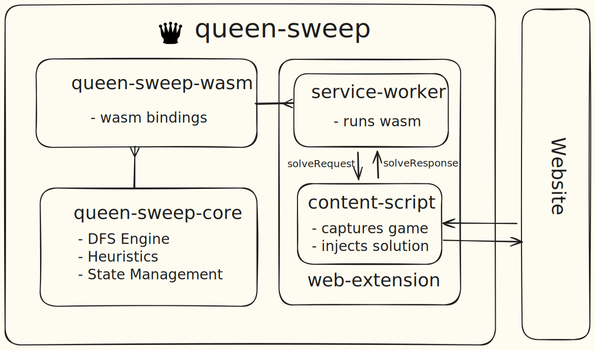

# ♛ QueenSweep

**QueenSweep** is a high-performance solver for [LinkedIn's Queens](https://www.linkedin.com/showcase/queens-game), featuring a Rust-based depth first search engine, WebAssembly compilation, and a chromium extension for seamless in-browser solving.

> [!NOTE]
> Because LinkedIn prohibits automated interaction with its platform, the Chromium extension is only supported on the [QueensGame website](https://queensgame.vercel.app) created by [samimsu](https://github.com/samimsu)

## 📋 Table of Contents
1. [Features](#-features)
2. [Demo](#-demo)
3. [Architecture](#️-architecture)
4. [Project Structure](#-project-structure)
5. [Running Locally](#-running-locally)

## 📃 Features
- **🚀 Blazingly Fast**: Solves majority of boards in under 5 milliseconds
- **🧠 Heuristic-Driven Search**: Pluggable, configurable heuristics to aggressively prune the search space
- **🌐 WebAssembly Runtime**: Compiled from Rust for near-native execution speed directly in the browser
- **🛰️ Integrated Browser Extension**: One-click solver injected directly in to the puzzle website

## 👾 Demo
The chromium extension injects an **Apply Solution** button once it detects a valid solution for the puzzle curently displayed on the page

<div align="center">


</div>

## 🏗️ Architecture


## 📂 Project Structure
```sh
# All major sub-directories
queen-sweep/
├── queen-sweep-core/           # Core rust engine
├── queen-sweep-macros/         # Procedural macros for core engine
├── queen-sweep-wasm/           # WASM bindings
└── queen-sweep-web-extension/  # Chromium extension
```

Each directory contains its own README with detailed information:
- [Core Engine](./queen-sweep-core/README.md)
- [Macros](./queen-sweep-macros/README.md)
- [WASM Bindings](./queen-sweep-wasm/README.md)
- [Chromium Extension](./queen-sweep-web-extension/README.md)

## 💻 Running Locally
Ensure the following prerequisites are available:
- [Rust](https://rustup.rs/)
- [Node.js](https://nodejs.org)
- [wasm-pack](https://github.com/drager/wasm-pack)


### Installing the Chromium Extension

1. Clone the repository
```bash
git clone https://github.com/lalitm1004/queen-sweep.git
cd queen-sweep
```

2. Build the WASM module
```bash
cd queen-sweep-web-extension
npm run wasm:build
```

3. Build the extension
```bash
npm i
npm run build
```
4. Load in Chrome
   - Navigate to `chrome://extensions/`
   - Enable "Developer mode"
   - Click "Load unpacked"
   - Select the `queen-sweep-web-extension/dist` directory
   
### Running the core engine
```bash
cd queen-sweep-core
cargo run --release
```

The core crate includes a main.rs file that lets you run the solver directly from the command line. You can modify both the heuristic and the puzzle level by editing this file.

```rs
fn run() -> Result<(), GameStateError> {
    // look in sample_levels.rs for more options
    let color_regions = puzzle_11x11();

    // look in heurstic.rs for more options
    let heuristic_fn: Option<HeuristicFn> = Some(smallest_region_by_empty_cells);
    let state = GameState::from_color_regions(color_regions, heuristic_fn)?;

    // --snip--
}
```

